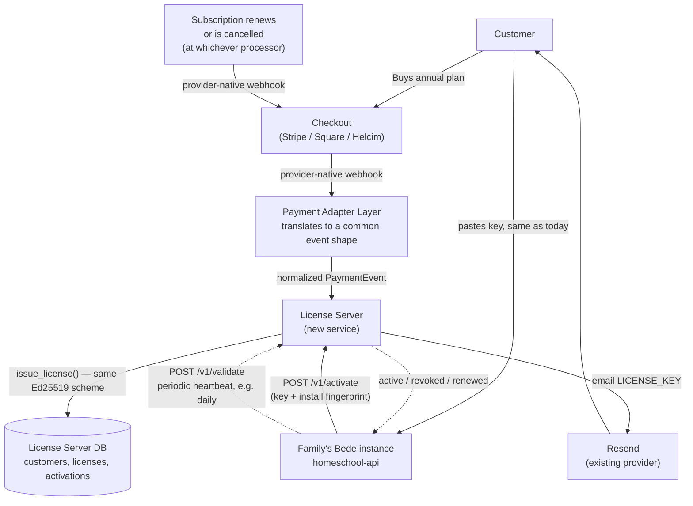

# Bede License Server — Design Document

**Status:** Design only. No implementation code lands with this document.
**Author's note on citations:** every file path, function, and behavior below was read from the actual `bede` source at design time. Anything asserted but not directly verified is marked **[to verify]**.

---

## 1. Why this document exists

Today, issuing a Bede license is a fully manual, offline act: an operator runs `homeschool-api/scripts/issue_license.py --private-key /path/to/private.pem` by hand, per sale, and emails the resulting `LICENSE_KEY=` string to the customer themselves (`docs/PRODUCTION_SETUP.md#licensing`). There is no payment integration, no automated delivery, and — as `core/licensing.py`'s own docstring states — **no revocation mechanism at all**: "a key exposed... is usable forever by anyone who finds it." This is fine at the scale of a handful of hand-issued trials. It does not scale to hundreds of paying families with annual renewals.

This document scopes a **License Server**: a new, small, separately-deployed service that turns license issuance, delivery, activation, renewal, and revocation into an automated pipeline driven by a payment processor, while deciding honestly what "copy-protected" can and cannot mean for a codebase every legitimate customer can already read.

## 2. Goals and explicit non-goals

**Goals:**
- **G1 — Automated issuance.** A customer pays → a license exists, is emailed, and is ready to activate, with no operator in the loop.
- **G2 — Automated annual renewal.** A subscription renews → the license keeps working, with no customer action and no re-pasting a new key string.
- **G3 — Revocation.** A refund, chargeback, or cancellation → the license stops working within a bounded time window, even on an already-activated instance.
- **G4 — Casual-copy resistance.** A license key pasted into a second, unauthorized instance should fail to activate there, distinct from today's "any signature-valid string works anywhere, forever."
- **G5 — Operate at "hundreds of families" scale** with unremarkable infrastructure — this is explicitly *not* a high-throughput system (§10).

**Non-goals (stated up front because getting this wrong wastes the whole effort):**
- **NG1 — This is not DRM against a self-hoster with source access.** `core/licensing.py`'s own docstring already says this plainly: "Anyone with the source... could patch this check out entirely — no signature scheme prevents that." A License Server changes *nothing* about that fact — a determined deployer can always delete the call to `license_state.refresh()` or hardcode `ok=True`. What this design *does* change: making that bypass a deliberate act of tampering with running code, rather than something that happens for free by copy-pasting a text string. Every mechanism below is scoped to stop **casual/accidental** sharing (a family forwards their key to a friend; someone finds a leaked key in a gist) and to give the business real levers (revoke, track, renew) — not to withstand reverse engineering.
- **NG2 — Not a requirement that self-hosted deployments lose offline operation permanently.** A family's LAN appliance still needs to keep tutoring through a home internet outage. The design below (§6.4) uses activate-once-then-periodic-revalidate-with-grace-period, never a hard per-request phone-home.
- **NG3 — Not a rewrite of the existing offline verification.** `core/licensing.py`'s Ed25519 signature scheme is sound, already embedded, and already proven in production. It stays as the cryptographic backbone (§8).

## 3. Current state (verified in source)

- **Format:** `base64url(payload_json) + "." + base64url(ed25519_signature)`. Payload: `id, licensee, tier, seats, issued, expires` (`core/licensing.py::verify_license`).
- **Verification:** fully offline, against `PUBLIC_KEY_PEM` embedded in `core/licensing.py`. No network call anywhere in this path.
- **Storage:** a license can live in `.env` (`LICENSE_KEY`) or in the DB (`LicenseConfig` table, applied live via `PUT /admin/license`, `routers/admin.py`). DB wins over env (`core/license_state.py::refresh`).
- **Enforcement:** `LicenseGateMiddleware` (`core/middleware.py`) restricts an ungated-license production instance to login + license-management routes only. `routers/pod.py` enforces the `seats` cap when adding a student.
- **Tiers:** `trial` (must expire), `core` (single household), `coop` (multi-household) — **superseded by §14's `tier1`/`tier2`/`tier3` service-level tiers**; `trial` itself is unaffected and stays the pre-purchase evaluation path into whichever of the three a family picks.
- **Issuance:** `homeschool-api/scripts/issue_license.py`, operator-run, requires the private key (never committed; lives outside the repo entirely).
- **Demo exemption:** `Settings.is_demo_deployment` (true whenever `DEMO_PIN` is set) skips the gate entirely — unaffected by anything in this document.

## 4. Architecture overview



The License Server is a **new, separate service** — it does not run inside `homeschool-api` and is never deployed to a family's LAN. It talks to the internet (the configured payment processor(s), Resend); a family's Bede instance talks to *it*, not the other way around, and only ever outbound.

## 5. Hosting recommendation — locked decision: Cloudflare Workers + D1

**Revised from an earlier draft of this document, which recommended Render + Postgres** (matching `bede-demo-api`'s existing pattern) and explicitly argued against Cloudflare because this repo's existing `wrangler.jsonc` is static-assets-only. That reasoning was correct about what's in the repo *today*, but incomplete about what Cloudflare Workers can actually do — modern Workers support real compute (a `main` script, not just `assets`), and **D1** (Cloudflare's serverless SQLite) is a genuine, production database, not a toy. Given Helcim as the chosen processor (§6.1) and an explicit preference for staying in the Cloudflare ecosystem, this is the better fit:

- **Compute:** a **new, second Cloudflare Worker project** — distinct from the existing `bede` static-assets Worker (`wrangler.jsonc`, `site/` + `demo/dist/`) — with its own `wrangler.jsonc` carrying a `main` script and a D1 binding. Not an addition to the existing static site's config.
- **Database:** D1 in place of Postgres. The License Server's own schema (§7) — four small tables, no complex joins, no need for Postgres-specific features — has no real requirement for a full RDBMS; D1 is a comfortable fit.
- **Cost, reinforcing the "least maintenance" theme from §12:** D1's free tier (5 GB storage, 100k rows written/day) and Workers' free tier (100k requests/day) comfortably cover "hundreds of families" — this service plausibly runs at **$0/month**, with true scale-to-zero (no idle server to pay for or patch) — a stronger fit for "least maintenance" than Render's always-on Postgres instance.
- **The real trade-off, stated plainly, not hidden:** Workers run JavaScript/TypeScript, not Python. Every other backend component in this repo (`homeschool-api`) is Python/FastAPI. The License Server becomes **a second language and runtime for the team to maintain**, isolated to this one service — `issue_license.py`'s Ed25519 signing logic (currently PyCryptodome, PEM-format keys) needs porting to Workers' native WebCrypto Secure Curves API (confirmed to support Ed25519 sign/verify — **[to verify]**: WebCrypto's key-import path may require converting the existing PEM private key to JWK format rather than importing it raw, worth confirming early rather than assuming a drop-in port). This is a real, bounded cost — one small, self-contained service, not a rewrite of anything else — accepted here because it was an explicit instruction, not something this document is picking on its own initiative.

Email delivery still reuses `services/email_service.py`'s existing pattern conceptually (plain REST calls to Resend, `_RESEND_URL = "https://api.resend.com/emails"`) — the Worker calls Resend's HTTP API directly (via `fetch`, Workers' native primitive) rather than sharing Python code with `homeschool-api`, since nothing here can be imported across the language boundary. Same vendor, no new email provider, just re-implemented at the HTTP-call level in the new runtime.

## 6. Component design

### 6.1 Payment integration — a vendor-neutral adapter layer over Stripe, Square, and Helcim

This repo already has a strong, proven precedent for exactly this shape of problem: `services/adapters/` decouples Bede's tutor from any single LLM vendor. Its own docstring states the pattern plainly — "An adapter is any object that presents that SAME surface... Everything else... becomes an adapter that TRANSLATES to and from that shape... so the ~2000 lines of prompt/tool/streaming logic... never have to change." The License Server should be built the same way for payments, not hardcoded to one processor.

**All three requested processors were verified to support the required primitives** (recurring/subscription billing + webhooks — not just one-time checkout):
- **Stripe** — Subscriptions + Checkout + webhooks (`checkout.session.completed`, `invoice.paid`, `customer.subscription.deleted`), signature-verified via a webhook signing secret. The most mature/standard of the three; **[to verify against this repo's actual future integration, not just public docs]**.
- **Square** — a dedicated Subscriptions API (`SubscriptionPlanVariation` for billing cadence/pricing) plus its own Webhook Subscriptions API; renewal payment status is tracked via the `invoices.payment_made` event or `Subscription.created`/updated events. Source: [Square Subscriptions API Overview](https://developer.squareup.com/docs/subscriptions-api/overview), [Subscription Billing and Invoices](https://developer.squareup.com/docs/subscriptions-api/subscription-billing), [Webhooks — Subscriptions API](https://developer.squareup.com/reference/square/subscriptions-api/webhooks).
- **Helcim** — a Recurring API (payment plan + subscription + add-on objects covering billing frequency, expiry, tax) with its own webhook system, signed HMAC-SHA256 via a per-account `verifierToken`. Source: [Helcim Recurring API](https://devdocs.helcim.com/docs/recurring-api), [Helcim Webhooks](https://devdocs.helcim.com/docs/webhooks).

**Design, mirroring `services/adapters/base.py` exactly:**
- A canonical, **Stripe-shaped internal vocabulary** for payment events (Stripe's object/event model is the most standard of the three, same reasoning `services/adapters/base.py` uses Anthropic's shape as the canonical one since the Anthropic adapter needs zero translation). A `PaymentEvent` type: `{type: "subscription_created" | "subscription_renewed" | "subscription_cancelled" | "payment_failed", customer_email, external_customer_id, external_subscription_id, tier, provider: "stripe" | "square" | "helcim"}`.
- A `PaymentAdapter` Protocol (mirroring `base.py`'s `runtime_checkable` Protocol pattern) with one implementation per processor. The Stripe adapter is near-passthrough (its webhook payloads already are this shape). The Square and Helcim adapters are translators — same role as `openai_compatible_adapter.py` plays for non-Anthropic LLM providers — converting each processor's own webhook payload and signature scheme into one `PaymentEvent`. Which vocabulary is canonical is independent of build order: Helcim is built first (§11 Phase 1) purely because it's the chosen primary, even though it's a translating adapter rather than the passthrough one.
- **The License Server's issuance/renewal/revocation logic (§6.2–§6.5) is written once against `PaymentEvent`, and never needs to know which processor fired.** This is the entire point of the pattern, restated from `base.py`'s own docstring: business logic doesn't change when a processor is added or swapped.

**Checkout CX — locked decision: one path, never a picker.** The customer picks a tier and hits one "Subscribe" button; which processor actually runs the charge is invisible to them — no "pay with Stripe / Square / Helcim" selector. This is the same shape as `BEDE_ADAPTER_ORDER`/`core/provider_state.py`'s primary-provider selection for AI adapters: exactly **one processor is configured as primary** at a time (env-default, live DB override, no restart — identical mechanism, reused verbatim), and only that processor's hosted checkout page is ever shown to a customer. All three adapters exist in the code from Phase 3 onward (§11) so the *business* can switch primaries later — a rate renegotiation, an outage, a new market — without a customer ever noticing or acting differently. This intentionally forecloses the "customer picks their processor at checkout" version of the earlier open question: it is strictly more CX complexity (an extra decision, on a page whose only job is to not lose the sale) for a choice that means nothing to the customer.
- **Checkout:** the one configured primary processor renders its own hosted checkout page (Stripe Checkout Session, Square Checkout, or Helcim's `HelcimPay.js` hosted fields) — the License Server never touches raw card data with any of the three, all handle PCI scope themselves.
- **Webhook signature verification is processor-specific and must live inside each adapter, not centrally** — Stripe uses a signing secret + its own SDK helper, Square has its own webhook-signature scheme, Helcim signs with HMAC-SHA256 against a `verifierToken`. Getting this wrong per-adapter is the single highest-severity implementation risk in this whole component (§8).
- **Trials — locked decision: self-serve, no card, through the License Server.** Simpler CX than "email us for a trial key": tier picker shows `trial` as a zero-payment option, same single flow, immediate email delivery — no separate off-platform request process for a prospective customer to navigate, and no operator in the loop (consistent with G1).

### 6.2 Issuance automation

On a normalized `subscription_created` `PaymentEvent` (translated from whichever processor's native webhook actually fired):
1. Look up `(provider, external_price/plan_id)` → map to `tier` + default `seats` (a small static config table per processor, not user input).
2. Sign the license payload using the **same wire format** `issue_license.py` produces (`base64url(payload_json) + "." + base64url(signature)`, same JSON field set) — reimplemented against Workers' WebCrypto Secure Curves API (§5) rather than PyCryptodome, since the License Server now runs in that runtime. The Ed25519 keypair lives with the License Server now (as a Workers Secret, `wrangler secret put`), not on an operator's laptop; see §8 for the key-custody implication. `core/licensing.py`'s verification side is completely unaffected either way — it only ever checks a signature against the embedded public key, never cares what produced it.
3. Insert a row into the License Server's own `licenses` table (§7) — this is the new, *authoritative*, mutable record, tagged with which processor and which external IDs it came from. The signed key string itself becomes closer to a bearer credential than the single source of truth (a real shift from today's model, spelled out in §6.3).
4. Email the `LICENSE_KEY=` value via Resend's HTTP API directly (§5) — same vendor and wire format `email_service.py` already uses, called via `fetch` rather than shared Python code.
5. No operator involved at any step.

### 6.3 What "annual" actually means now — the key design shift

Today, a license's `expires` date is **baked into the signed payload** — the only way to "renew" is to issue and paste an entirely new key string (see `docs/PRODUCTION_SETUP.md`: "renewals and upgrades are pasted straight into the app"). That's a bad automated-renewal experience: nobody wants to re-paste a string every year, and it means the family's own action (pasting) becomes a required step in a process that's supposed to be automatic.

**Proposed change:** issue licenses **without a baked-in `expires`** (or with a long nominal one, e.g. +5 years, as a dead-man's-switch floor) and make the **License Server's own `licenses.status` + `licenses.valid_until` columns the authoritative, live-updated truth**, communicated to the instance via the activation/heartbeat protocol (§6.4) — not by minting a new key string. A renewal — a normalized `subscription_renewed` `PaymentEvent`, from whichever processor actually fired it — simply updates that row's `valid_until`; the family's instance picks it up on its next heartbeat, with zero action from them. This is the same trust shift `core/license_state.py` already made once before, moving from "verify once at import time" to "an in-app, no-restart-needed live update" — this extends that same trajectory one step further, from *manual* live update to *automatic* live update.

This means `core/license_state.py::EffectiveLicense` needs a new field for "server-reported validity," which can now **override** the signed payload's own (now largely nominal) expiry in both directions — extend past it, or revoke before it. The signature verification in `core/licensing.py` is unchanged and still runs first; the server-reported status is an additional, later check.

### 6.4 Activation & periodic revalidation protocol

This is the actual mechanism behind G4 (casual-copy resistance) and the piece that requires new code inside `homeschool-api`, not just the License Server.

- **Install fingerprint:** at first boot, if none exists yet, generate a random UUID (**not** hardware-derived — Docker/VM churn makes hardware fingerprinting both unreliable and hostile to a legitimate migration to new hardware) and persist it, conceptually identical to `core/encryption.py`'s existing `device_salt`-at-first-boot pattern. Call it `install_id`.
- **`POST /v1/activate`** (License Server): body `{license_key, install_id}`. Server verifies the key's signature (defense in depth — same public key, or the server can just trust its own DB row now that it's the issuer), checks `licenses.status == active`, and checks the activation cap:
  - New field distinct from the existing `seats` (which means *students in one pod*, an unrelated dimension): `max_activations` — how many separate installs one license may bind, defaulting to **2** for a standard single-family license (§12 — a self-heal allowance for an ordinary server rebuild/migration, not the abuse case this targets). Enforced by counting rows in a new `activations` table scoped to that `license_id`. (§14 introduces `tier1`/`tier2`/`tier3` service-level tiers, orthogonal to this activation-count dimension — re-mapping `max_activations` per new tier, if it should differ from the flat default of 2, is a small follow-up, not designed here.)
  - First activation for a fresh `install_id` under the cap: insert an `activations` row, return `{status: "active", valid_until: ...}`.
  - A **different** `install_id` attempting to activate a license already at its cap: rejected — this is the actual "copy-paste to a second machine" case G4 targets.
  - The *same* `install_id` re-activating (e.g., container recreated, `install_id` persisted through a volume) is idempotent, not a new activation.
- **`POST /v1/validate`** (heartbeat): body `{license_key, install_id}`, called periodically by the running instance (proposed: daily, jittered, background task — not blocking any request). Returns current `{status, valid_until}`. This is how a renewal or a revocation — at whichever processor is actually in use — reaches an already-running instance without the family doing anything.
- **Offline grace period:** the instance caches the last successful heartbeat's result **locally**, tamper-evident the same way `core/constitution.py` digest-pins the constitution file (verified checksum, not just trusted plaintext) so an offline deployer can't simply edit a cache file to grant themselves permanent access. If the License Server is unreachable, the instance keeps operating on the cached status for a bounded window — proposed **30 days** — then gates with a clear "reconnect to revalidate" message, mirroring the existing gated-mode UX (`LicenseGateMiddleware` + the parent-visible License card), not a hard failure. This satisfies NG2: a family's home internet outage, or a genuinely air-gapped install that only connects occasionally, keeps working.

### 6.5 Revocation

A normalized `subscription_cancelled` or `payment_failed` (past whichever processor's own dunning/retry schedule) `PaymentEvent` → License Server sets `licenses.status = revoked`. The next `/v1/validate` heartbeat from that install reports `revoked`; `core/license_state.py` treats that exactly like an expired license does today (gated, parent sees a clear message) — no new UI concept needed, this reuses the existing gated-mode path end to end.

## 7. Data model (License Server's own DB — separate from a family's `homeschool-api` DB)

```
customers        id, email, created_at
licenses          id, customer_id, tier, seats, max_activations,
                  status (active | revoked | trial),
                  valid_until,
                  payment_provider (stripe | square | helcim | none),
                  external_customer_id, external_subscription_id,
                  license_key (the signed string, stored for re-delivery),
                  created_at
activations       id, license_id, install_id, first_seen_at, last_heartbeat_at
webhook_events    id, payment_provider, external_event_id,
                  unique(payment_provider, external_event_id) — idempotency,
                  type, received_at
```

Every processor's IDs (`external_customer_id`, `external_subscription_id`, `webhook_events.external_event_id`) are scoped by `payment_provider` rather than assumed to be Stripe's — a `customer_id` from Square and one from Helcim are different ID spaces that must never collide. `webhook_events`'s composite unique constraint is the standard, necessary defense against at-least-once webhook delivery — a property all three processors document, not just Stripe — every adapter's handler must be idempotent, or a retried `subscription_created` event double-issues a license.

## 8. Security considerations

- **Private key custody changes.** Today the signing private key lives entirely offline, on an operator's machine, touched only per manual issuance — about as safe as a private key can be. Moving issuance in-process on the License Server means that key now lives on a running, internet-facing service. This is a real, deliberate trade for automation and needs its own hardening: stored as a **Workers Secret** (`wrangler secret put`, Cloudflare's equivalent of Render's secret env vars — same never-in-source, never-logged handling as the rest of this repo's credentials), and the Worker should be the *only* thing with read access to it — no admin UI ever displays it.
- **Webhook authenticity, per processor, not once.** Each of the three has its own scheme — Stripe's signing-secret + SDK helper, Square's own webhook-signature key, Helcim's HMAC-SHA256 against a per-account `verifierToken` — and each `PaymentAdapter` (§6.1) must implement its own correctly. Getting even one wrong means `POST` to that adapter's webhook URL is an unauthenticated "issue me a free license" endpoint. This is a per-adapter code-review item, not something a shared/central check can fully cover, precisely because the three schemes aren't unifiable.
- **Rate limiting on `/v1/activate` and `/v1/validate`**, mirroring `core/middleware.py`'s existing `RateLimitMiddleware` bucket pattern (per-IP sliding window) — these are the two endpoints most likely to be probed by someone testing whether a shared key still works elsewhere.
- **What this still cannot do:** stop a technically sophisticated deployer from patching `core/license_state.py` to hardcode `ok=True`, or from replaying a captured `/v1/validate` "active" response forever. Restated from §2 — this is not being oversold as a solved problem.

## 9. Client-side changes needed in `homeschool-api`

- `core/license_state.py`: new `install_id` generation/persistence (first-boot, alongside the existing `device_salt` pattern); a new background task calling `/v1/activate` (once) and `/v1/validate` (periodic); `EffectiveLicense` gains a server-reported-status field that can override the signed payload's nominal expiry in either direction.
- `core/config.py`: new setting, the License Server's base URL (empty/unset = today's fully-offline behavior preserved — a **self-hosted family that never wants any outbound license traffic can still opt out**, falling back to the exact current offline-only verification; this preserves the honest, LAN-only story for anyone who wants it, at the cost of losing auto-renewal and needing manual key re-pasting, same as today).
- `routers/admin.py`: `GET /admin/license` response gains `activations_used` / `max_activations` for the parent's own visibility.
- **`.env.example` / `docs/PARENT_SETUP.md` / `docs/PRODUCTION_SETUP.md#licensing`**: updated per this repo's standing feature-documentation workflow once this is actually built — not part of this design-only document.

## 10. Scale analysis

"Hundreds of families" is, bluntly, a small workload: hundreds of rows across four tables, an activation call per install (once) and a heartbeat per install per day. D1's free tier alone (5 GB storage, 100k rows written/day) and Workers' free tier (100k requests/day) — see §5 — comfortably absorb this with no special scaling work, no queue, no cache layer, no multi-region need, and plausibly no bill at all. The actual engineering risk in this design is **correctness** (webhook idempotency, activation-cap logic, grace-period edge cases) and **key custody** (§8), not throughput. Scaling this further (thousands of families) would still likely not require re-architecting — Workers/D1 scale by design, not by an operator provisioning a bigger instance.

## 11. Phased rollout

- **Phase 1 — Foundation, one live processor.** License Server skeleton (Cloudflare Worker + D1, §5), the four tables (already provider-scoped, §7), the `PaymentAdapter` Protocol with **one** real implementation — **Helcim**, chosen for lowest effective cost to the seller (no monthly platform fee, no per-recurring-charge surcharge, interchange-plus averaging below Stripe's and Square's online rates for this specifically-recurring-billing use case) — configured as primary, plus the self-serve no-card trial flow and automated paid issuance + email. Before writing the adapter, confirm Helcim's merchant-account underwriting process in practice — it has a reputation for more manual approval than Stripe's instant self-serve signup, worth verifying doesn't stall Phase 1 before committing further engineering time. `max_activations` generously high (e.g. 5) at this stage — proves the pipeline without yet being strict. Manual paste into `PUT /admin/license` still works exactly as today (no client changes required yet) — the License Server can exist and issue real licenses before `homeschool-api` knows it exists at all.
- **Phase 2 — Client integration.** `install_id`, `/v1/activate` + `/v1/validate` wired into `homeschool-api`, 30-day offline grace period (uniform across tiers), server-reported status overriding signed expiry. `max_activations` tightened to **2** for the standard case (§12), enforced for real.
- **Phase 3 — Stripe and Square adapters.** Because Phase 1 already wrote the issuance/renewal/revocation logic against the processor-neutral `PaymentEvent` shape (§6.1), adding each remaining processor is scoped to *one new adapter* (webhook translation + signature verification) — no changes to §6.2–§6.5's logic, and **no change to the checkout page a customer sees** unless the operator deliberately switches the configured primary (§6.1's "one path, never a picker" decision). These exist for business flexibility (a Helcim underwriting issue, a rate renegotiation, redundancy) rather than a near-term need — order between Stripe and Square is a business call, not a technical one — open (§13).
- **Phase 4 — Operator tooling.** Admin-facing dashboard on the License Server (list customers/licenses, manual revoke/comp a license, resend delivery email) — replaces the last remaining manual step (§6.2 already automates issuance itself; this phase is about *support*, not issuance). Existing hand-issued licenses (including the CI test key) are migrated into the License Server's DB in this phase too (§12) — one system going forward, not two running in parallel indefinitely.

## 12. Locked decisions (this revision)

Made using one consistent lens — the simplest, lowest-friction customer experience — since that was the explicit instruction driving this revision:

- **Checkout is always one path.** Exactly one processor is configured as primary at a time (§6.1); a customer never sees or makes a processor choice. Building three adapters is a business-flexibility move, not a customer-facing feature.
- **Trials are self-serve, no card, one flow.** Same tier-picker page as a paid purchase, `trial` just skips the payment step entirely — no separate "email us" process (§6.1).
- **`max_activations` = 2 by default, not 1.** A family replacing/rebuilding their server is normal, expected operation, not the abuse case G4 targets (a *second household* copying the key) — defaulting to 1 would turn an ordinary hardware swap into a support ticket. 2 self-heals that without weakening the actual protection.
- **Grace period is 30 days, uniform across all tiers.** A tier-differentiated grace period is one more rule a customer (or support) has to know and explain; the uniform value is simpler and there's no evidence any tier needs materially longer slack than another.
- **Existing hand-issued licenses (including the CI test key) get migrated into the License Server's DB (Phase 4), not left as permanent legacy.** Running two license systems forever is more operational complexity, not less — migrating them means every license, old or new, goes through the same revocable, trackable path.

## 13. Remaining open questions

1. **Stripe-vs-Square ordering for Phase 3:** which comes second is a business call (e.g., wanting Stripe's maturity as the first fallback given it's the easiest to integrate, versus an existing Square POS/banking relationship) — doesn't block Phase 1 or 2 either way, so it can be answered whenever, not before implementation starts.
2. **Tier 3 billing primitive:** does its metered billing genuinely need ad-hoc per-event charging (vs. Helcim's subscription/payment-plan-shaped Recurring API, which is a different primitive) — needs its own small spike, not an assumption.
3. **Tier 3 "no updates":** confirm this means no new/premium features (requiring the feature-gating work in §14.1) rather than something else.

## 14. Pricing & service tiers (replaces the old `trial`/`core`/`coop` split)

**Scope boundary, stated up front:** this section designs what the License Server needs to *track and enforce* per tier. It deliberately does **not** design the human-delivery side of Tiers 1 and 2 (specialist scheduling, coaching session logistics, community check-in hosting) — that's a staffing/CRM/scheduling problem, a different system from a payment-and-license server. What follows treats those as *entitlements* the License Server records, fulfilled by something else.

**Revised from an earlier draft of this section**, which proposed a separate free, perpetual "Tier 0" as a top-of-funnel option — rejected as a mistake (no free/perpetual tier). Community access instead folds directly into Tier 3 below, which stays the low-commitment entry point without ever being free: pay-per-use, not $0.

The three paid tiers replace `core`/`coop`; `trial` (§3) stays a separate, time-limited, full-featured evaluation a prospective customer moves through before picking one of the three.

- **Tier 1 — Concierge.** Full platform access plus a human-delivered layer: guide-based coaching for the parent, delivered by education specialists (deliberately generalists, matching Charlotte Mason's own "broad, living education" ethos rather than narrow subject-matter specialists). Flat annual subscription (§6.3's server-tracked-`valid_until` renewal model applies as designed). The License Server's only responsibility here is the entitlement flag (`licenses.tier = "tier1"`) a separate booking/CRM system reads to know a family is eligible — no scheduling logic belongs in this design.
- **Tier 2 — Guided self-service.** Full platform capabilities, guided diagnostics, still fundamentally self-service — plus weekly *community* check-ins (group, not 1:1) that reference the family's actual platform-tracked progress data for reinforcement. Same flat annual subscription mechanics as Tier 1. Same scope boundary: the License Server tracks the entitlement (`licenses.tier = "tier2"`); the check-ins themselves (scheduling, hosting, content) are a separate system.
- **Tier 3 — Metered, with community access.** Platform access billed **per diagnostic test, $15/test**, not a flat subscription — no live 1:1 training, and (pending confirmation, §13) no access to new/premium features added after signup. **Includes the same weekly community check-ins as Tier 2** — the low-commitment, pay-only-for-what-you-use option still gets the community layer, it just doesn't carry Tier 1/2's flat annual fee or Tier 1's 1:1 coaching. This is the one tier that changes §6–§7's design, not just the tier label:
  - **A new `PaymentEvent` type is needed**: `usage_charged` (`{license_id, quantity: 1, unit_price_cents: 1500}`), distinct from the subscription lifecycle events §6.1 already defines.
  - **`homeschool-api` needs a new reporting hook**: wherever a diagnostic test actually completes (`services/diagnostic/`, per `CLAUDE.md`'s existing description of the real, DB-backed diagnostic engine — distinct from `services/diagnostic_demo.py`'s ephemeral demo-only store, which is correctly out of scope here since demo sessions never carry a license at all) — that completion needs to call the License Server to record and charge the usage event. This is new, not covered by §6.4's activate/heartbeat protocol, which only ever reports license *status*, never usage.
  - **Processor choice for this tier specifically is unresolved (§13).** §6.1/§11 picked Helcim for Phase 1 based on its Recurring API (subscription-plan billing) — verified to exist, not verified to cover arbitrary ad-hoc per-event charges the way Tier 3 needs. Helcim does expose a separate one-off "process a payment against a stored card" endpoint that could plausibly serve this (charge $15 against the customer's card on file per completed test), but that's a distinct capability from the Recurring API this document already verified, and needs its own confirmation before Tier 3 is built — worth treating as a small, separate spike before committing to it, not an assumption folded silently into Phase 1.
  - **"No paid learning outcomes"** is read here as: Tier 3 carries no outcome-based guarantee or premium reporting layer beyond the raw diagnostic result itself — full result per paid test, just no bundled coaching around interpreting it, and (pending §13) no new features beyond what's in the base platform at signup.
  - **Community-hosting cost, worth naming plainly:** unlike the rejected Tier 0, this is bundled into a *paid* tier, so the community layer's marginal cost is covered by Tier 3's own revenue rather than given away for free — the actual concern that made a perpetual free tier the wrong call.

### 14.1 Feature-gating: Tier 3 vs. Tiers 1/2, not one tier's edge case anymore

Tier 3's "no new/premium features" (pending §13's confirmation) sits against Tiers 1/2's full capabilities — a real distinction to enforce, not just a label. **Nothing like this exists in the codebase today** — `core/licensing.py`'s `tier` field currently gates exactly two things (the license-required boot gate, and `routers/pod.py`'s `seats` cap), never *which features run*. This needs its own small piece of design before Phase 2 client-integration work starts, not an implicit assumption:

- A `tier_features` capability table (License Server side, or a static map in `homeschool-api` keyed by the tier string already present in `EffectiveLicense` — either works; the latter is simpler since it needs no new server round-trip beyond the license status the client already fetches).
- The actual surface this gates is still underspecified — pending §13's confirmation of what "new features" excludes for Tier 3 — since unlike the rejected Tier 0 design, there's no single obvious gate point (a summary-vs-full diagnostic view) to anchor it to anymore.
