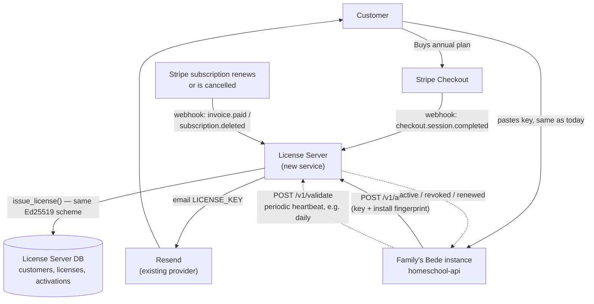

# Bede License Server — Design Document

**Status:** Design only. No implementation code lands with this document.
**Author's note on citations:** every file path, function, and behavior below was read from the actual `bede` source at design time. Anything asserted but not directly verified is marked **[to verify]**.

---

## 1. Why this document exists

Today, issuing a Bede license is a fully manual, offline act: an operator runs `homeschool-api/scripts/issue_license.py --private-key /path/to/private.pem` by hand, per sale, and emails the resulting `LICENSE_KEY=` string to the customer themselves (`docs/PRODUCTION_SETUP.md#licensing`). There is no payment integration, no automated delivery, and — as `core/licensing.py`'s own docstring states — **no revocation mechanism at all**: "a key exposed... is usable forever by anyone who finds it." This is fine at the scale of a handful of hand-issued trials. It does not scale to hundreds of paying families with annual renewals.

This document scopes a **License Server**: a new, small, separately-deployed service that turns license issuance, delivery, activation, renewal, and revocation into an automated pipeline driven by a payment processor, while deciding honestly what "copy-protected" can and cannot mean for a codebase every legitimate customer can already read.

## 2. Goals and explicit non-goals

**Goals:**
- **G1 — Automated issuance.** A customer pays → a license exists, is emailed, and is ready to activate, with no operator in the loop.
- **G2 — Automated annual renewal.** A subscription renews → the license keeps working, with no customer action and no re-pasting a new key string.
- **G3 — Revocation.** A refund, chargeback, or cancellation → the license stops working within a bounded time window, even on an already-activated instance.
- **G4 — Casual-copy resistance.** A license key pasted into a second, unauthorized instance should fail to activate there, distinct from today's "any signature-valid string works anywhere, forever."
- **G5 — Operate at "hundreds of families" scale** with unremarkable infrastructure — this is explicitly *not* a high-throughput system (§10).

**Non-goals (stated up front because getting this wrong wastes the whole effort):**
- **NG1 — This is not DRM against a self-hoster with source access.** `core/licensing.py`'s own docstring already says this plainly: "Anyone with the source... could patch this check out entirely — no signature scheme prevents that." A License Server changes *nothing* about that fact — a determined deployer can always delete the call to `license_state.refresh()` or hardcode `ok=True`. What this design *does* change: making that bypass a deliberate act of tampering with running code, rather than something that happens for free by copy-pasting a text string. Every mechanism below is scoped to stop **casual/accidental** sharing (a family forwards their key to a friend; someone finds a leaked key in a gist) and to give the business real levers (revoke, track, renew) — not to withstand reverse engineering.
- **NG2 — Not a requirement that self-hosted deployments lose offline operation permanently.** A family's LAN appliance still needs to keep tutoring through a home internet outage. The design below (§6.4) uses activate-once-then-periodic-revalidate-with-grace-period, never a hard per-request phone-home.
- **NG3 — Not a rewrite of the existing offline verification.** `core/licensing.py`'s Ed25519 signature scheme is sound, already embedded, and already proven in production. It stays as the cryptographic backbone (§8).

## 3. Current state (verified in source)

- **Format:** `base64url(payload_json) + "." + base64url(ed25519_signature)`. Payload: `id, licensee, tier, seats, issued, expires` (`core/licensing.py::verify_license`).
- **Verification:** fully offline, against `PUBLIC_KEY_PEM` embedded in `core/licensing.py`. No network call anywhere in this path.
- **Storage:** a license can live in `.env` (`LICENSE_KEY`) or in the DB (`LicenseConfig` table, applied live via `PUT /admin/license`, `routers/admin.py`). DB wins over env (`core/license_state.py::refresh`).
- **Enforcement:** `LicenseGateMiddleware` (`core/middleware.py`) restricts an ungated-license production instance to login + license-management routes only. `routers/pod.py` enforces the `seats` cap when adding a student.
- **Tiers:** `trial` (must expire), `core` (single household), `coop` (multi-household).
- **Issuance:** `homeschool-api/scripts/issue_license.py`, operator-run, requires the private key (never committed; lives outside the repo entirely).
- **Demo exemption:** `Settings.is_demo_deployment` (true whenever `DEMO_PIN` is set) skips the gate entirely — unaffected by anything in this document.

## 4. Architecture overview



The License Server is a **new, separate service** — it does not run inside `homeschool-api` and is never deployed to a family's LAN. It talks to the internet (Stripe, Resend); a family's Bede instance talks to *it*, not the other way around, and only ever outbound.

## 5. Hosting recommendation

Reuse the exact pattern already proven for `bede-demo-api`: `render.yaml` Docker web service + Render Postgres. Concretely: a new Render Blueprint (or a second service block in a shared one) — small Python/FastAPI service, matching the existing stack's language and conventions so it's maintainable by the same team, not a second tech stack to learn. **Not** Cloudflare Workers: `wrangler.jsonc` in this repo is explicitly static-assets-only (`site/` + `demo/dist/`, no `main` script, "deploys as pure static hosting, no compute") — this needs a real stateful API with a database, which is exactly Render's existing role here, not Cloudflare's.

Email delivery reuses `services/email_service.py`'s existing pattern exactly: plain `httpx` calls to Resend's REST API (`_RESEND_URL = "https://api.resend.com/emails"`), no new vendor, no SDK dependency.

## 6. Component design

### 6.1 Payment integration — Stripe

Stripe is the only reasonable choice here: subscriptions, webhooks, invoicing, dunning (automatic retry on a failed card), tax handling, and a hosted Checkout page are all built in, and virtually every downstream automation piece (issuance, renewal, revocation) is *already* modeled as a Stripe webhook event — this isn't a build-vs-buy question at "hundreds of families" scale.

- **Products:** one Stripe Product per tier (`core`, `coop`), each with an annual recurring Price. `trial` stays entirely outside Stripe — trials are still operator-issued or self-serve-without-payment (open question, §12).
- **Checkout:** Stripe Checkout Session, `mode: subscription`. Customer enters email + card; Stripe handles PCI scope entirely — the License Server never touches card data.
- **Webhooks consumed** (signature-verified via Stripe's webhook secret, standard practice):
  - `checkout.session.completed` → new license, issue + email (§6.2).
  - `invoice.paid` (on renewal, not the first invoice — that's covered by `checkout.session.completed`) → extend the license's server-side validity (§6.3).
  - `customer.subscription.deleted` / `invoice.payment_failed` (past Stripe's own retry schedule) → revoke (§6.5).

### 6.2 Issuance automation

On `checkout.session.completed`:
1. Look up the Price → map to `tier` + default `seats` (a small static config table, not user input).
2. Call the **same** `issue_license.py` signing logic (refactored into an importable function the License Server calls in-process — the Ed25519 keypair lives with the License Server now, not on an operator's laptop; see §8 for the key-custody implication).
3. Insert a row into the License Server's own `licenses` table (§7) — this is the new, *authoritative*, mutable record. The signed key string itself becomes closer to a bearer credential than the single source of truth (a real shift from today's model, spelled out in §6.3).
4. Email the `LICENSE_KEY=` value via Resend, using a new template alongside the existing ones in `email_service.py`'s pattern (`build_summary_email_html`, `build_feedback_email_html`, etc.).
5. No operator involved at any step.

### 6.3 What "annual" actually means now — the key design shift

Today, a license's `expires` date is **baked into the signed payload** — the only way to "renew" is to issue and paste an entirely new key string (see `docs/PRODUCTION_SETUP.md`: "renewals and upgrades are pasted straight into the app"). That's a bad automated-renewal experience: nobody wants to re-paste a string every year, and it means the family's own action (pasting) becomes a required step in a process that's supposed to be automatic.

**Proposed change:** issue licenses **without a baked-in `expires`** (or with a long nominal one, e.g. +5 years, as a dead-man's-switch floor) and make the **License Server's own `licenses.status` + `licenses.valid_until` columns the authoritative, live-updated truth**, communicated to the instance via the activation/heartbeat protocol (§6.4) — not by minting a new key string. A Stripe renewal (`invoice.paid`) simply updates that row's `valid_until`; the family's instance picks it up on its next heartbeat, with zero action from them. This is the same trust shift `core/license_state.py` already made once before, moving from "verify once at import time" to "an in-app, no-restart-needed live update" — this extends that same trajectory one step further, from *manual* live update to *automatic* live update.

This means `core/license_state.py::EffectiveLicense` needs a new field for "server-reported validity," which can now **override** the signed payload's own (now largely nominal) expiry in both directions — extend past it, or revoke before it. The signature verification in `core/licensing.py` is unchanged and still runs first; the server-reported status is an additional, later check.

### 6.4 Activation & periodic revalidation protocol

This is the actual mechanism behind G4 (casual-copy resistance) and the piece that requires new code inside `homeschool-api`, not just the License Server.

- **Install fingerprint:** at first boot, if none exists yet, generate a random UUID (**not** hardware-derived — Docker/VM churn makes hardware fingerprinting both unreliable and hostile to a legitimate migration to new hardware) and persist it, conceptually identical to `core/encryption.py`'s existing `device_salt`-at-first-boot pattern. Call it `install_id`.
- **`POST /v1/activate`** (License Server): body `{license_key, install_id}`. Server verifies the key's signature (defense in depth — same public key, or the server can just trust its own DB row now that it's the issuer), checks `licenses.status == active`, and checks the activation cap:
  - New field distinct from the existing `seats` (which means *students in one pod*, an unrelated dimension): `max_activations` — how many separate installs one license may bind, defaulting to **1** for `core` and a small operator-set number for `coop` (one per participating household). Enforced by counting rows in a new `activations` table scoped to that `license_id`.
  - First activation for a fresh `install_id` under the cap: insert an `activations` row, return `{status: "active", valid_until: ...}`.
  - A **different** `install_id` attempting to activate a license already at its cap: rejected — this is the actual "copy-paste to a second machine" case G4 targets.
  - The *same* `install_id` re-activating (e.g., container recreated, `install_id` persisted through a volume) is idempotent, not a new activation.
- **`POST /v1/validate`** (heartbeat): body `{license_key, install_id}`, called periodically by the running instance (proposed: daily, jittered, background task — not blocking any request). Returns current `{status, valid_until}`. This is how a Stripe renewal or a revocation actually reaches an already-running instance without the family doing anything.
- **Offline grace period:** the instance caches the last successful heartbeat's result **locally**, tamper-evident the same way `core/constitution.py` digest-pins the constitution file (verified checksum, not just trusted plaintext) so an offline deployer can't simply edit a cache file to grant themselves permanent access. If the License Server is unreachable, the instance keeps operating on the cached status for a bounded window — proposed **30 days** — then gates with a clear "reconnect to revalidate" message, mirroring the existing gated-mode UX (`LicenseGateMiddleware` + the parent-visible License card), not a hard failure. This satisfies NG2: a family's home internet outage, or a genuinely air-gapped install that only connects occasionally, keeps working.

### 6.5 Revocation

`customer.subscription.deleted` or a payment permanently failing (past Stripe's dunning retries) → License Server sets `licenses.status = revoked`. The next `/v1/validate` heartbeat from that install reports `revoked`; `core/license_state.py` treats that exactly like an expired license does today (gated, parent sees a clear message) — no new UI concept needed, this reuses the existing gated-mode path end to end.

## 7. Data model (License Server's own DB — separate from a family's `homeschool-api` DB)

```
customers        id, email, stripe_customer_id, created_at
licenses          id, customer_id, tier, seats, max_activations,
                  status (active | revoked | trial),
                  valid_until, stripe_subscription_id,
                  license_key (the signed string, stored for re-delivery),
                  created_at
activations       id, license_id, install_id, first_seen_at, last_heartbeat_at
webhook_events    id, stripe_event_id (unique — idempotency), type, received_at
```

`webhook_events.stripe_event_id` as a unique constraint is the standard, necessary defense against Stripe's documented at-least-once webhook delivery — every handler must be idempotent, or a retried `checkout.session.completed` double-issues a license.

## 8. Security considerations

- **Private key custody changes.** Today the signing private key lives entirely offline, on an operator's machine, touched only per manual issuance — about as safe as a private key can be. Moving issuance in-process on the License Server means that key now lives on a running, internet-facing service. This is a real, deliberate trade for automation and needs its own hardening: environment-secret storage (Render's secret env vars, matching existing `RESEND_API_KEY`/`ANTHROPIC_API_KEY` handling), never logged, and the server process should be the *only* thing with read access to it — no admin UI ever displays it.
- **Webhook authenticity.** Stripe webhook signature verification is non-negotiable — without it, `POST` to the webhook URL is an unauthenticated "issue me a free license" endpoint.
- **Rate limiting on `/v1/activate` and `/v1/validate`**, mirroring `core/middleware.py`'s existing `RateLimitMiddleware` bucket pattern (per-IP sliding window) — these are the two endpoints most likely to be probed by someone testing whether a shared key still works elsewhere.
- **What this still cannot do:** stop a technically sophisticated deployer from patching `core/license_state.py` to hardcode `ok=True`, or from replaying a captured `/v1/validate` "active" response forever. Restated from §2 — this is not being oversold as a solved problem.

## 9. Client-side changes needed in `homeschool-api`

- `core/license_state.py`: new `install_id` generation/persistence (first-boot, alongside the existing `device_salt` pattern); a new background task calling `/v1/activate` (once) and `/v1/validate` (periodic); `EffectiveLicense` gains a server-reported-status field that can override the signed payload's nominal expiry in either direction.
- `core/config.py`: new setting, the License Server's base URL (empty/unset = today's fully-offline behavior preserved — a **self-hosted family that never wants any outbound license traffic can still opt out**, falling back to the exact current offline-only verification; this preserves the honest, LAN-only story for anyone who wants it, at the cost of losing auto-renewal and needing manual key re-pasting, same as today).
- `routers/admin.py`: `GET /admin/license` response gains `activations_used` / `max_activations` for the parent's own visibility.
- **`.env.example` / `docs/PARENT_SETUP.md` / `docs/PRODUCTION_SETUP.md#licensing`**: updated per this repo's standing feature-documentation workflow once this is actually built — not part of this design-only document.

## 10. Scale analysis

"Hundreds of families" is, bluntly, a small workload: hundreds of rows across four tables, an activation call per install (once) and a heartbeat per install per day. A single small Postgres instance and one lightweight web service (matching `bede-demo-db`'s `basic-256mb` plan, or smaller) handles this without any special scaling work — no queue, no cache layer, no multi-region need. The actual engineering risk in this design is **correctness** (webhook idempotency, activation-cap logic, grace-period edge cases) and **key custody** (§8), not throughput. Scaling this further (thousands of families) would still likely not require re-architecting — it would mean upgrading the Render plan, nothing structural.

## 11. Phased rollout

- **Phase 1 — Foundation.** License Server skeleton (FastAPI + Postgres on Render), the four tables, Stripe Checkout + the three webhooks, automated issuance + email. Activation protocol built but `max_activations` generously high (e.g. 5) — proves the pipeline without yet being strict. Manual paste into `PUT /admin/license` still works exactly as today (no client changes required yet) — the License Server can exist and issue real licenses before `homeschool-api` knows it exists at all.
- **Phase 2 — Client integration.** `install_id`, `/v1/activate` + `/v1/validate` wired into `homeschool-api`, offline grace period, server-reported status overriding signed expiry. `max_activations` tightened to real values (1 for `core`).
- **Phase 3 — Operator tooling.** Admin-facing dashboard on the License Server (list customers/licenses, manual revoke/comp a license, resend delivery email) — replaces the last remaining manual step (§6.2 already automates issuance itself; this phase is about *support*, not issuance).

## 12. Open questions (need your decision, not mine)

1. **Trials:** stay fully outside Stripe (operator-issued, as today), or add a self-serve no-card trial flow through the License Server too?
2. **`max_activations` default for `core`:** exactly 1, or a small allowance (e.g. 2) for a family with a primary server plus a spare/rebuild-in-progress machine?
3. **Grace period length:** is 30 days right, or should it differ by tier (e.g. longer for `coop`, which may have less consistent IT attention)?
4. **Existing hand-issued licenses (including the CI test key):** migrated into the License Server's DB retroactively (so they're revocable too), or left as pure legacy offline-only keys forever?
5. **Pricing/tiers:** this document assumed the existing `core`/`coop` split maps directly to Stripe Products — confirm, or is pricing changing alongside this?
